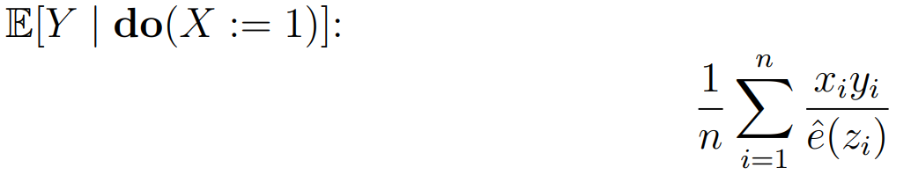

# ihdp-causality

The purpose of this project is to apply a treatment effect estimator to a dataset provided from the Infant Health and Development Program (IHDP). The estimator will help determine the causal effect of intensive high-quality childcare from a trained provider (the treatment) on the cognitive test scores of premature infants (the outcome).

The dataset given is organized as follows
* Column 1: treatment, whether it was given to the infant (*xi*)
* Column 2: outcome of the child's cognitive test score (*yi*)
* Columns 3-27: 25 features of the mother and child (i.e. child's birth weight, mother's age and race, whether mother smoked during pregnancy, etc.), (*zi*)

The code simply fits a logistic regression model on the data and uses it to predict the treatment (*xi*) from the features (*zi*) and estimates the treatment effect quantitatively. This model will then be used to show whether there is beneficial causal effect on the outcome in the following formula  ,   where *e(zi)* is the inverse propensity score weighting that denotes the probability the treatment is administered given the value of the confounders and *yi* denotes the outcome.
